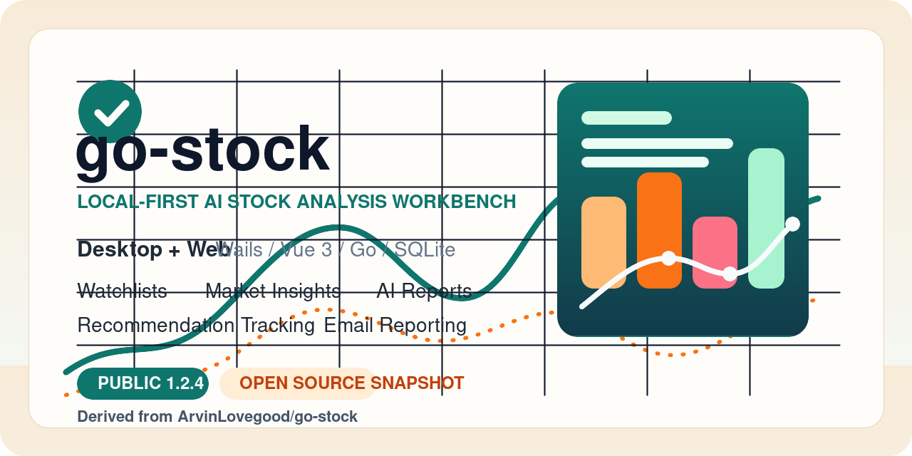

# go-stock



## 当前版本：App 1.8.1

Go-Stock 是基于 Go、Vue 3、Naive UI 和 SQLite 的本地股票行情与 AI 研究工具。本版本保留市场行情、股票自选和基金，并建立研究中心从 AI 分析到模拟交易净收益的完整流程。

[Releases](https://github.com/yxforever666gh/go-stock/releases) | [发布说明](./RELEASE_NOTES.md)

> 本仓库基于公开项目 [`ArvinLovegood/go-stock`](https://github.com/ArvinLovegood/go-stock) 演化，不是原作者官方仓库。

## 1.7.x 核心流程

1. 在沪深交易日的 `09:30、11:30、14:30` 自动启动分级分析；时间和 AI 配置可在设置页调整。
2. AI 依次完成大盘、板块、个股和最终决策分析，整合现有新闻、研报、公告、资金流、宏观、财务、概念、实时行情与 K 线数据。
3. 每轮允许空仓，并可从现有最多 15 只 shortlist 中推荐任意数量的可交易沪深 A 股；涨跌停、停牌、北交所和批次内重复候选会在入库前由代码过滤。
4. AI 推荐按最新可交易行情直接模拟买入；非交易时段完成的推荐顺延至下一有效交易时段并只尝试一次。
5. 买入后的下一交易日从 09:50 起按固定 15 分钟时点复查实时行情、分钟量价和增量事件，由 AI 判断“持有 / 卖出”；停牌或跌停时进入待卖状态。
6. 研究中心展示 AI 分析报告、股票推荐记录、股票收益率和完整判断时间线。

旧策略、cohort、冻结回放、runtime guard、preflight、策略审计、旧收益重算和 AI 智能体均已退出运行链路。1.6.6 将旧策略表永久压缩归档后移出活动库，运行链不再读取或写入这些历史数据。

## 模拟账户与净收益

- 初始资金：固定 `500,000 元`，不再计划或执行追加注资
- 不限制持仓总数或重复股票；每个推荐按独立仓位核算，待买任务仍按候选行情、最小整手和费用预留资金
- 单只股票现金支出目标：`50,000 元`；选择实际支出首次严格超过目标的最小整手。若目标仓位现金不足，则回退为可承担的最大整手；连一手也无法承担才跳过
- 普通沪深 A 股：100 股整数倍；科创板首次申报至少 200 股
- 成本：佣金、最低佣金、卖出印花税、过户费和双边滑点
- 净收益额：`现金 + 持仓按可卖出净值估值 - 500,000 元固定初始资金`
- 策略净收益率：使用固定本金口径的单位净值与时间加权收益率（TWR）

已平仓交易采用实际净现金流；未平仓持仓按最新价扣除预计卖出成本估值。1.7.x 不计算或展示基准收益率、超额收益率和 XIRR。

## 界面结构

- 市场行情：保留快讯、指数、行业排名、资金流、龙虎榜、公告、研报、热点、选股与名站信息。
- 研究中心：仅保留 `AI分析报告`、`股票推荐记录`、`股票收益率` 三个页签。
- 设置：按通用、数据接口、AI 分析和配置管理分组；分钟线接口与 AI 模型都可拖动排序并独立启停。
- AI 分析：自动开关只控制定时触发，研究中心手动分析始终调用同一分析后端和同一组模型；持仓复查的开始时间与间隔可配置。

## AI 配置

AI 模型配置表从上到下即为回退顺序，关闭的模型会被跳过。研究调用采用流式接收：连续 300 秒没有有效推理、心跳、状态或正文事件才超时，活跃推理不限制总时长。瞬态错误在当前模型最多尝试 5 次，不可恢复错误立即切换下一模型。API Key 仍由用户在本机设置，迁移不会复制或生成密钥。

Responses API 优先使用 `previous_response_id` 延续单股会话；中转站不支持续接时，只重发该股票本地保存并压缩后的历史消息。

## 数据库

- 主库 schema：`12`
- 分钟库 schema：`2`
- 1.6.x 表统一使用 `research_v160_` 前缀

schema 3 创建分析运行、推荐、生命周期消息、AI 决策事件、模拟账户、交易和持仓表；schema 4 增加逐模型启用状态；schema 5 增加脱敏的模型调用诊断记录；schema 7 增加生命周期证据快照；schema 8 将旧待激活记录迁移到一次性直接买入流程；schema 9 在永久归档后删除 1.5 旧策略表；schema 10 增加分期入金、资金预留、单位净值与策略评估快照；schema 11 增加分钟线接口顺序和持仓复查时间配置；schema 12 将账户追溯重置为固定 50 万元并补记经核准的 8 月 24 日中国平安独立仓位。分钟库保持 schema 2。

## 本地运行

要求 Go 1.25+、Node.js 20+。

```powershell
cd frontend
npm install
npm run build
cd ..
go run .
```

默认监听 `http://127.0.0.1:34115`，可用 `--web-addr` 修改监听地址。

已部署的 Windows 发布物可直接双击 `启动项目.cmd`；如只需启动服务、不打开浏览器，可运行：

```powershell
.\启动项目.cmd -NoBrowser
```

网络来源审计已从主程序移到独立开发工具，需要时运行：

```powershell
.\scripts\network-audit.ps1
```

## 验证

```powershell
go test ./...
go vet ./...
go run ./cmd/openapi-contract
cd frontend
npm run ci
```

## 许可证

许可证与第三方来源说明见 [LICENSE](./LICENSE)。股票数据和 AI 输出仅用于研究与软件验证，不构成投资建议。
