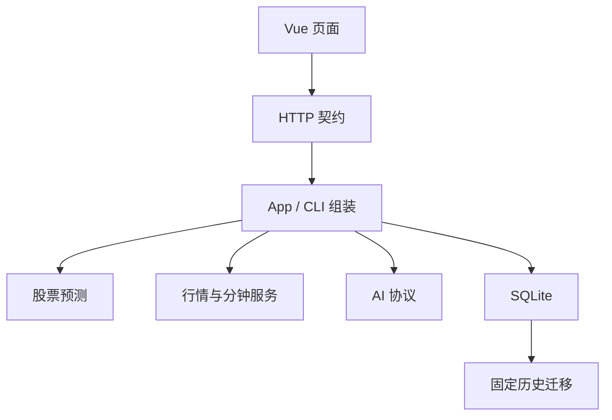

# Stock God 结构与维护边界

产品只保留股票预测、设置、关于三个页面。行情、基金/ETF、分钟数据和 MCP 继续提供数据接口；股票自选、研究中心一、知识库的页面、API、定时任务和模型注入已退役。

## 代码归属

| 位置 | 职责 | 常见改动 |
| --- | --- | --- |
| `src/stock_god/prediction/` | 冻结证据、评分与报告、24 个账户、模拟成交、收益、邮件 | 策略、资金分配、报表 |
| `src/stock_god/market/` | 行情提供者、来源验证、图表数据、题材、分钟 API/MCP | 数据源、字段解析、数据质量 |
| `src/stock_god/ai/` | 流式模型协议、超时、重试、模型回退 | 模型接入 |
| `src/stock_god/storage/` | SQLite 连接、事务、备份、归档、迁移入口 | 数据安全 |
| `src/stock_god/storage/historical/` | 已发布旧版本的固定升级规则和结构定义 | 仅修复经验证的旧库兼容问题 |
| `app.py` / `cli.py` / `runtime.py` | 依赖组装、HTTP/命令入口、进程和调度生命周期 | 启动、路由、进程恢复 |
| `settings.py` / `audit.py` | 配置快照及 CAS 保存、不可变审计和模型对照回放 | 配置或审计契约 |
| `frontend/src/` | Vue 展示、请求状态、交互图表 | 可视化和交互 |
| `api/openapi.yaml` / `contracts.py` | 公开 HTTP 契约、实际路由检查、生成 TS | 接口增删或 DTO 修改 |

股票预测通过注入的能力调用行情和 AI，不导入其具体实现；行情模块不反向调用预测策略。存储层不导入当前业务。`tests/test_boundaries.py` 使用 Python AST 检查这些关系，包含相对导入和动态模块导入。

## 一次预测的数据流

1. 入口深拷贝配置和模型顺序，建立运行、证据及审计身份。
2. 提供者验证市场覆盖率、截止时点和已闭合分钟数据；完整资料冻结入库。
3. 模型只收到紧凑快照和对应候选的评分依据。完整市场原文保留在审计库，避免重复挤占模型上下文。
4. 服务端检查来源归属、时间、分项范围并重新计算总分；一次 SQLite 写事务决定实际归属时段、首份报告、推荐和邮件队列。
5. 独立账户按排名、剩余现金和剩余成功买入名额执行，最多五笔；卖出和重启补偿不依赖新报告成功。
6. 费用、现金、成交和账本快照同事务提交；收益和图表读取相同账本。

关闭自动策略会撤销旧运行的发布和新买入许可，已有持仓继续退出。重新开启不会恢复已撤销的旧运行。模型回放不会写入正式推荐和账户。

## 数据兼容

- 工作数据库仍使用 `research2_*` 表、`research2` owner 和历史 UUID 命名空间；显示名改为“股票预测”不改变这些身份。
- 研究中心一、知识库和自选历史数据保留于同一数据库及其归档，当前服务不恢复它们的入口。
- 历史迁移只能由显式数据库命令或受控部署调用，普通页面读取和单元测试不得触发迁移。
- 修改当前费用或策略时，不修改历史迁移内固定的旧算法。需要重算历史时，使用显式预演/应用命令并核对计划哈希。

## 防止再次膨胀

每次改动先确定唯一业务归属，删除被替换的实现及失效入口。只在真实调用需要时抽取公共能力；不为未来研究中心、策略模式或插件增加开关。数据提供者返回事实和来源状态，预测层决定业务结果，前端不重算账户财务规则。

普通任务先运行对应文件测试；跨包契约改变再运行匹配领域检查。新接口、配置、schema、后台任务或较大增量必须说明必要性和长期维护成本。验证流程与发布步骤见 [运行与发布](operations.md)。
